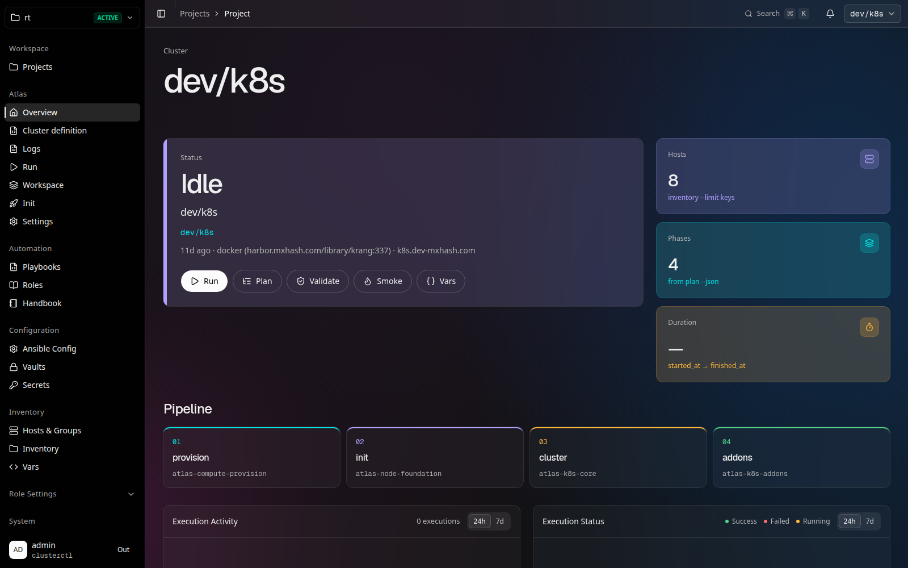
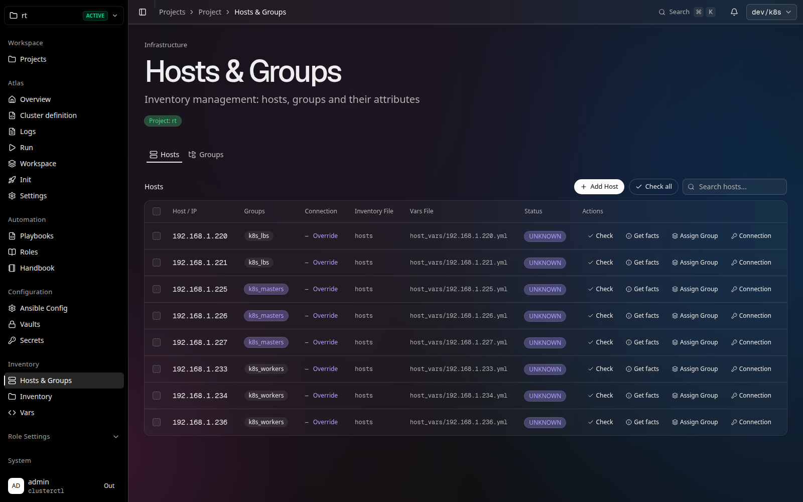
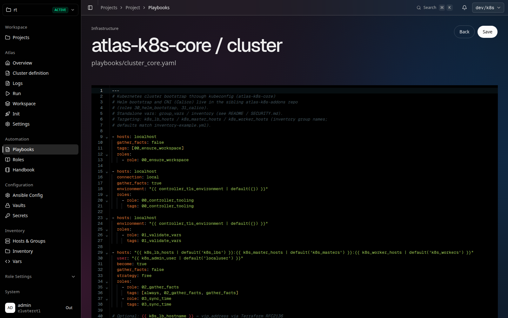
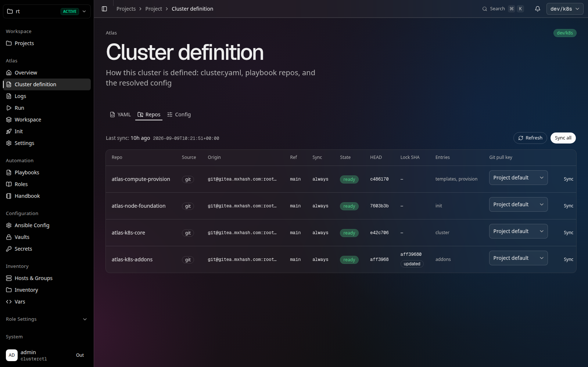
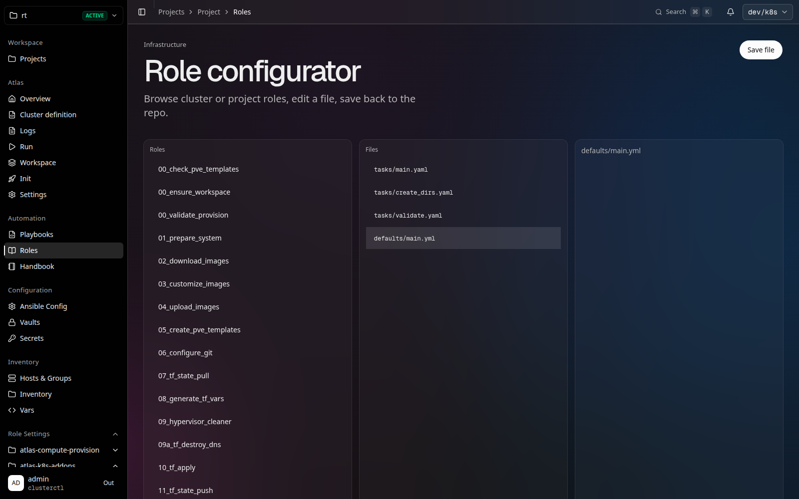
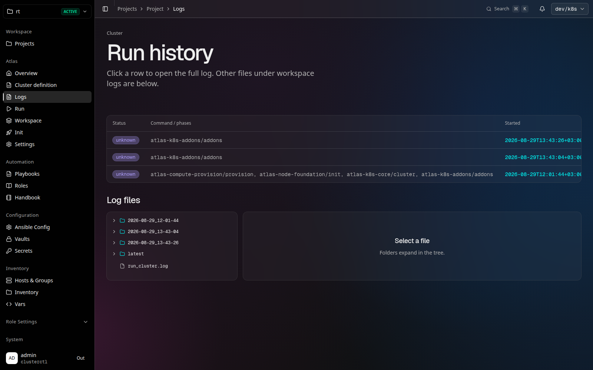
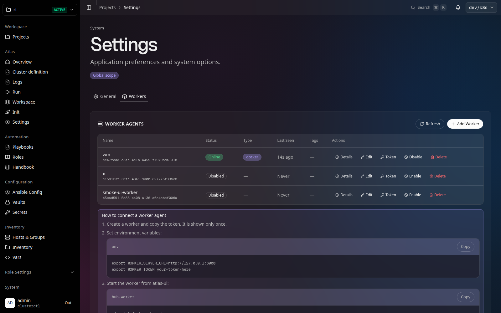

# atlas-ui

**A self-hosted Infrastructure as Code console for Ansible and Atlas clusterctl.**
Design, manage, and execute infrastructure as code — with Git integration, distributed workers, and a built-in scheduler.

---

## Documentation

**[→ Full documentation](documentation/README.md)** — Docker setup, first login, project quick start, Git sync.

---

## Quick Start

```bash
git clone git@github.com:yokozu777/atlas-ui.git
cd atlas-ui
cp .env.example .env   # host ATLAS_* paths and SSH_KEY
docker compose -f docker-compose.hub.yml pull
docker compose -f docker-compose.hub.yml up -d
```

Open http://localhost:3000 — username `admin`, password from `data/auth/admin-initial.txt` (change it after first login).

Hub API: http://localhost:8000. Bind-mounts and `.env` are required for atlas/clusterctl runs; details in [Docker quick start](documentation/01-docker-quickstart.md).

---

## What It Is

A **self-hosted Infrastructure as Code management platform** for teams that already live in Ansible and clusterctl.

It turns playbooks, inventory YAML, and Atlas cluster definitions
into a **managed engineering system** with transparent changes, repeatable executions, and controlled access.

Two immutable project kinds:

- **ansible** — playbooks, inventory, Git sources, vaults, cron scheduler
- **atlas** — clusterctl clusters (`cluster.yaml`, repos, lock SHA, docker or local executor)

The platform helps teams to:

- bring order to complex infrastructure
- accelerate change delivery
- reduce human errors
- scale IaC across dozens or hundreds of servers

**This is not just Ansible.**
**It is a control plane for Infrastructure as Code and platform engineers.**

## User Interface Overview

### Dashboard
<p align="center">
 
</p>
Cluster overview: status, host count, pipeline phases, and shortcuts to plan, validate, smoke, and run.

---

### Hosts & Inventory
<p align="center">
 
</p>
Manage hosts, groups, and inventory files with visibility into variables and SSH connections.

---

### Playbook Editor
<p align="center">
 
</p>
Open playbooks from Git or clusterctl clones, edit YAML in the browser, preview, and execute with forks, timeout, verbosity, and dry-run.

---

### Cluster definition (Git-native)
<p align="center">
 
</p>
For atlas projects: `cluster.yaml`, playbook repos, HEAD and lock SHA, per-repo Git pull keys, and Sync / Sync all.

---

### Roles
<p align="center">
 
</p>
Browse roles from synced repositories, edit `defaults` and `tasks`, and save back to the clone. Role Settings in the sidebar follows the same Git trees.

---

### Runs & Executions
<p align="center">
 
</p>
Track execution history, inspect logs, and monitor playbook or clusterctl runs in real time.

---

### Workers
<p align="center">
 
</p>
Manage execution workers, scale horizontally, and control parallel infrastructure operations.

---

## What It Brings Together

- Ansible inventory
- roles and playbooks
- host and group variables
- Atlas `cluster.yaml` and playbook repos
- Git-based workflows and lock SHA
- task execution and scheduling
- parallel workers and execution queues

All combined into a **single visual, manageable, and reproducible interface**,
built for production environments and collaborative teams.

---

## Why Teams Need It

As infrastructure grows:

- manual runs become risky
- YAML stops being “self-explanatory”
- changes lose auditability
- different engineers solve the same problems differently

The platform addresses this by:

- standardizing infrastructure workflows
- making changes observable and auditable
- reducing the *bus factor*
- accelerating *day-2 operations*
- turning infrastructure into a **predictable product**, not a set of scripts

---

## Key Features

### Inventory & Variables

- Host and group management
- Host vars and group vars
- Visual control of variable scope and inventory files
- Atlas inspect of the live clusterctl inventory leaf

### Playbook Editor

- UI-based YAML editor
- Target selection by groups or individual hosts
- Execution parameter control:
  - forks
  - timeout
  - verbosity
  - dry-run
- Preview the final rendered YAML before execution

### Clusterctl (atlas projects)

- Cluster overview from `plan` / `stages` / `validate`
- Repos sync with lock SHA
- Run with phases, tags, `--limit`, extra vars, `--root-ssh`, executor local or docker
- Workspace and run logs on disk under `ATLAS_WORKSPACE_ROOT`

### Execution Engine & Workers

- Multiple workers for parallel execution
- Horizontal scalability under load
- Project-level task isolation
- Real-time execution monitoring

### Scheduler

- Cron-like task scheduler on ansible playbooks
- Recurring executions
- Automated day-2 operations

### Security & Access

- Centralized users and permissions
- Controlled `become` / `--root-ssh`
- SSH keys and Git pull keys stored in the hub, not in Git
- Project and environment isolation

---

## Typical Use Cases

- Cluster management (Kubernetes, Redis, PostgreSQL, service nodes)
- Server configuration and hardening
- Backup, restore, and compliance automation
- Scheduled maintenance
- CI/CD for infrastructure
- Day-2 operations

---

## Product Philosophy

> **Infrastructure should be reproducible, auditable, and boring.**
> This platform makes it visible, manageable, and safe.

---

## How It Stands Out

- UI **on top of IaC**, not instead of it
- Git as the source of truth for playbooks and cluster definitions
- Ansible projects and atlas-clusterctl in one console
- No vendor lock-in
- Full transparency for every change
- Suitable for both small teams and large production clusters

---

## License

Apache-2.0 — see [LICENSE](LICENSE).

Local development, tests, and clusterctl CLI mapping: [CONTRIBUTING.md](CONTRIBUTING.md).
